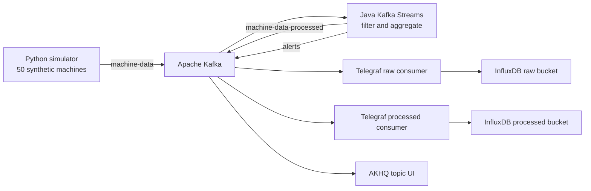

# Industrial Machine Data Pipeline

A 2024 prototype that generates synthetic machine telemetry, sends it through Apache Kafka, processes selected events with Kafka Streams, and stores raw and processed measurements in InfluxDB through Telegraf.

> **Development context:** The original implementation was completed in 2024, before I used agentic coding tools. Documentation, configuration and packaging were cleaned up in 2026 with Claude Code. The original Git history has been preserved.

## What I built

I implemented the Python telemetry generator, the Java Kafka Streams processing logic, and the Docker-based connection between Kafka, ZooKeeper, AKHQ, Telegraf, and InfluxDB. This repository is a local technical prototype, not a production deployment.

## System architecture



The producer creates one synthetic reading per machine per second and publishes keyed JSON messages to `machine-data`. The stream application keeps messages whose status is `Running` or `Maintenance`, forwards them to `machine-data-processed`, aggregates energy readings in one-minute windows, and writes totals above the prototype threshold to `alerts`. Telegraf consumes the raw and processed topics into separate InfluxDB buckets.

## Technology

| Component | Technology | Role |
| --- | --- | --- |
| Data generation | Python, `kafka-python` | Produce synthetic machine messages |
| Message transport | Apache Kafka, ZooKeeper | Carry keyed event streams |
| Stream processing | Java, Kafka Streams, Maven | Filter and aggregate events |
| Collection | Telegraf | Consume Kafka JSON |
| Storage | InfluxDB 2 | Store time-series values |
| Inspection | AKHQ | Inspect local Kafka topics |
| Runtime | Docker, Docker Compose | Run services locally |

## Local setup

Prerequisites: Docker with Docker Compose v2. Maven is needed only to test the Java project outside Docker.

```bash
git clone https://github.com/Lukaschanger/KafkaDocker.git
cd KafkaDocker
cp .env.example .env
```

Start Kafka, ZooKeeper, and AKHQ:

```bash
docker compose -f broker/docker-compose.yml up -d
```

Build and run the producer and stream processor on the same Docker network:

```bash
docker build -t machine-data-producer producer
docker run -d --name producer --network kafka-network machine-data-producer

docker build -t machine-data-streamer streamer
docker run -d --name kafka-streamer --network kafka-network machine-data-streamer
```

Start InfluxDB:

```bash
docker run -d \
  --name influxdb2 \
  --network kafka-network \
  -p 8086:8086 \
  -v influxdb2_data:/var/lib/influxdb2 \
  influxdb:2.0
```

Open <http://localhost:8086>, complete the local setup, and create:

- organization: the value of `INFLUX_ORG` in `.env`;
- buckets: `machine-data` and `machine-data-processed`; and
- an API token that can write to both buckets.

Replace the placeholder in `.env`, load the values into the shell, and start both Telegraf consumers:

```bash
set -a
. ./.env
set +a

docker run -d \
  --name telegraf-producer \
  --network kafka-network \
  -e INFLUX_URL -e INFLUX_TOKEN -e INFLUX_ORG \
  -v "$PWD/telegraf/telegraf.conf:/etc/telegraf/telegraf.conf:ro" \
  telegraf:1.30

docker run -d \
  --name telegraf-stream \
  --network kafka-network \
  -e INFLUX_URL -e INFLUX_TOKEN -e INFLUX_ORG \
  -v "$PWD/telegrafstream/telegraf.conf:/etc/telegraf/telegraf.conf:ro" \
  telegraf:1.30
```

AKHQ is available at <http://localhost:8080>. Use it to inspect `machine-data`, `machine-data-processed`, and `alerts`.

## Example data

The data is synthetic. A producer message looks like:

```json
{
  "machine_id": "M001",
  "installation_date": "2020-02-02",
  "timestamp": "2024-09-01T12:00:00",
  "general": {
    "energy_consumption": 24.7,
    "operating_minutes": 382,
    "status": "Running"
  },
  "hydraulics": {"temperature": 48.3, "pressure": 112.5},
  "spindle": {"vibration": 2.14, "temperature": 55.6, "rotation_speed": 4200},
  "production": {"pieces_produced": 37, "time_per_piece": 91.4}
}
```

Messages that pass the status filter are forwarded unchanged to `machine-data-processed`. An alert value has the form `High energy consumption alert: {"total_energy": 1024.5}`.

## Verification

```bash
docker compose -f broker/docker-compose.yml config
docker build -t machine-data-producer producer
docker build -t machine-data-streamer streamer
mvn -f streamer/pom.xml test
```

## Limitations

- All machine data is synthetic and does not model a particular factory or machine.
- The stack uses one local Kafka broker, plaintext connections, and no access-control layer.
- Machine status changes once per minute; messages between status updates contain a null status and do not pass the stream filter.
- The aggregation is a fixed rule, not anomaly detection or machine learning.
- InfluxDB organization, buckets, and token are created manually.
- The original project has no automated end-to-end test suite.

## Project status

Completed 2024 portfolio prototype. The 2026 cleanup removed generated broker logs and build artifacts, replaced a committed InfluxDB token and local IP address with environment variables, and clarified reproducible setup. It did not redesign the original pipeline.

## License

No license is currently included. MIT would be a reasonable option if broad reuse is intended.
